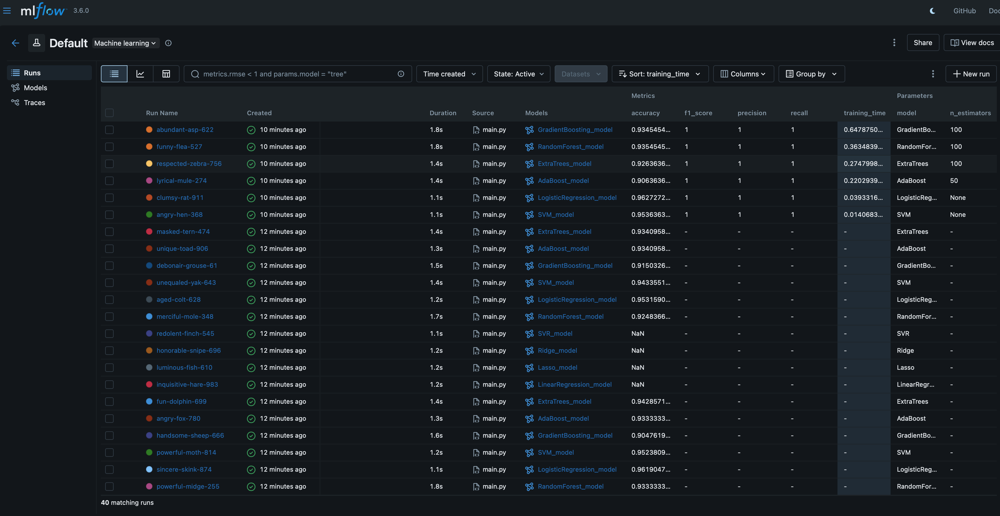
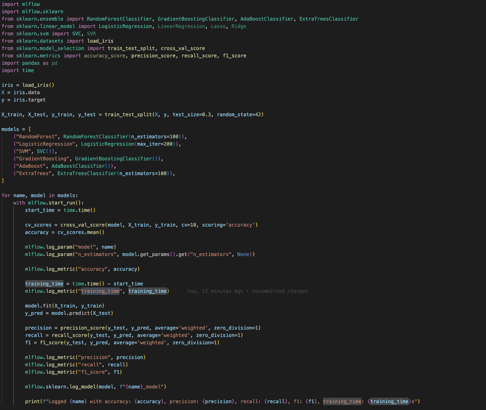
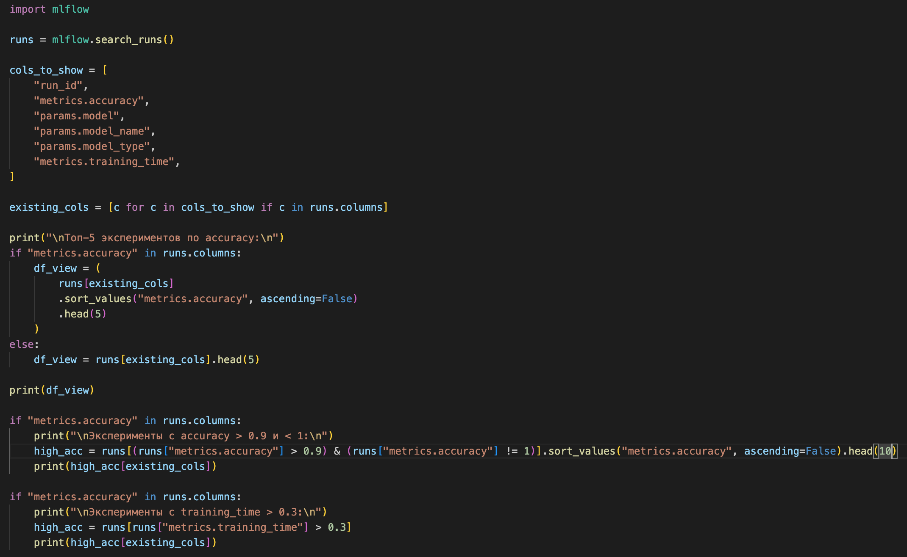
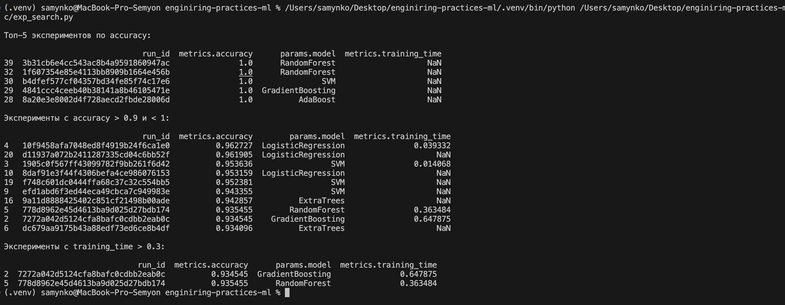

# 📘 Отчёт по ДЗ №3  
## Тема: Настройка рабочего места Data Scientist  

**Студент:** Семён Мынко  
**Дата:** 19.11.2025  

---

## 1. Цель работы
Настройте систему трекинга экспериментов и проведите серию ML экспериментов.
---

## 2. Настройка выбранного инструмента 
### Инструмент: MLflow

**Установка и инициализация:**
```bash
pip install mlflow
ENV MLFLOW_TRACKING_URI=http://localhost:5000
mlflow ui
```


**Настройка системы версионирования моделей и добавления метаданных:**


**Для сравнения моделей можно использовать метаданные, которые мы добавляли выше:**


## 3. Проведение экспериментов

### Проведение экспериментов:

**Были проведены эксперименты с разными моделями и параметрами:**



**Фильтрацию и сравнение можно производть качерез код, так и через UI:**




## 4. Интеграция с кодом

### В пунктах выше показано, что у инструмента уже есть неплохие встроенные методы для интеграции в код

### Однако мной были добавлены функции для логирования и часто повторяющихся задач

```python
# декоратор для логирования скора
def log_experiment(func):
    def wrapper(*args, **kwargs):
        with mlflow.start_run():
            result = func(*args, **kwargs)
            
            mlflow.log_param("model_type", func.__name__)
            
            if hasattr(result, "score"):
                accuracy = result.score(args[2], args[3])
                mlflow.log_metric("accuracy", accuracy)
            return result
    return wrapper
```

```python
# функция для передачи гиперпараметров модели
def log_params_and_model(model, model_name, params):
    for param, value in params.items():
        mlflow.log_param(param, value)
    mlflow.sklearn.log_model(model, model_name)
```

### Примеры интеграции кода можно посмотреть по ссылке
[Интеграция](src/exp_integration.py) \
[Утилиты](src/exp_utils_and_decs.py)

