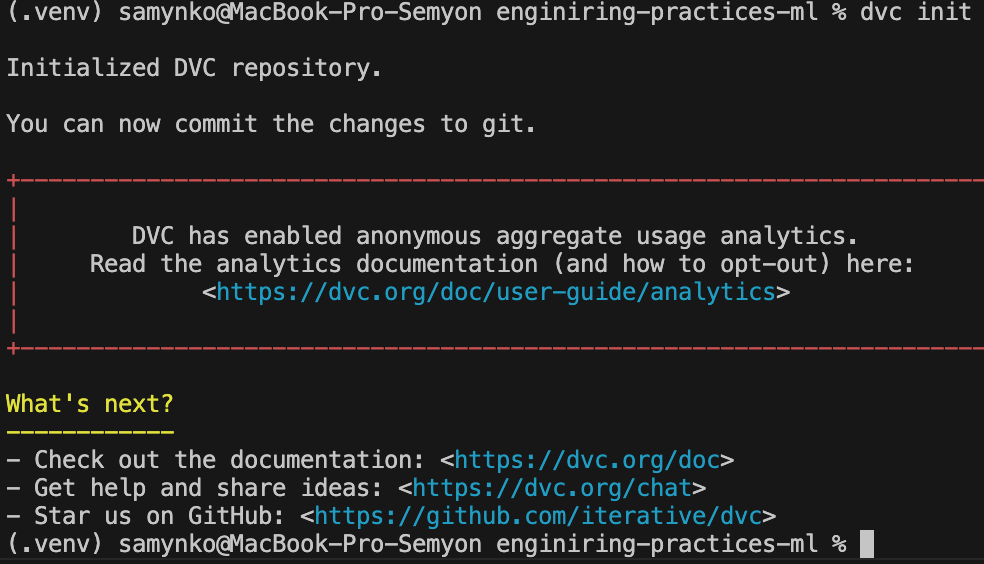
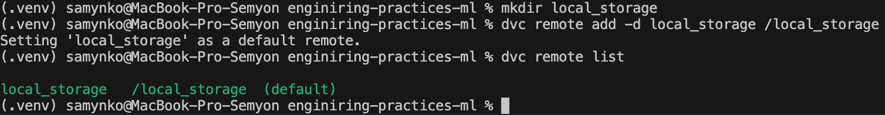
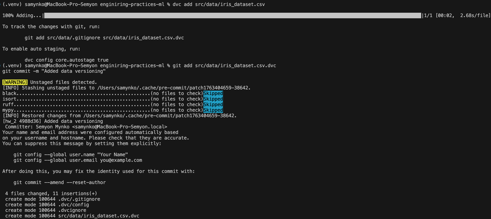
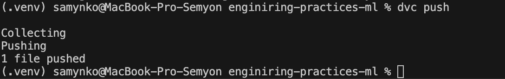
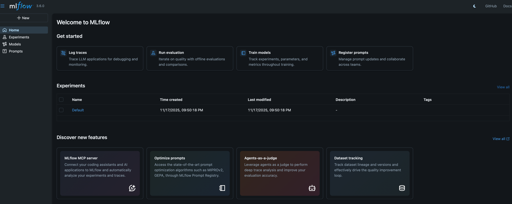
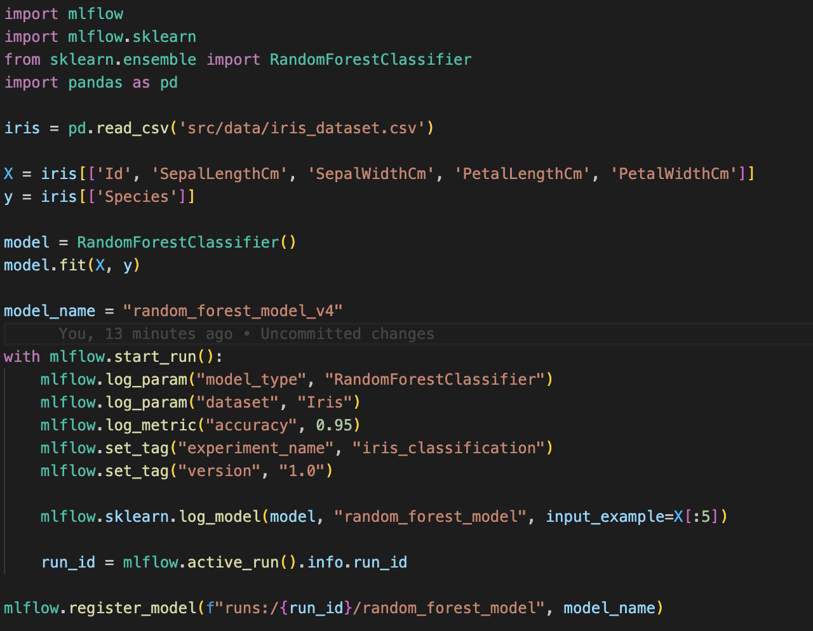
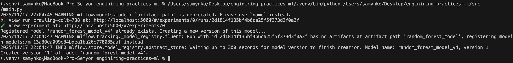
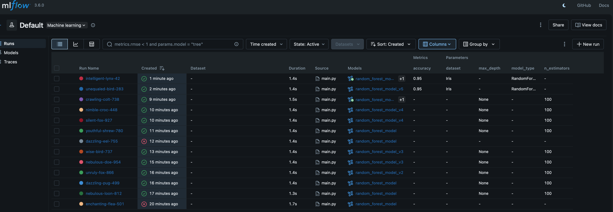

# 📘 Отчёт по ДЗ №2  
## Тема: Настройка рабочего места Data Scientist  

**Студент:** Семён Самынко  
**Дата:** 17.11.2025  

---

## 1. Цель работы
Настройте систему версионирования данных и моделей для ML проекта.
---

## 2. Настройка выбранного инструмента для данных

### Инструмент: **DVC**
Установка и инициализация DVC:
```bash
pip install dvc
```


Настройка хранилища:
```bash
dvc remote add
```


Добавление датасета:
```bash
dvc add
```


Пуш датасета:
```bash
dvc push
```


## 3. Настройка выбранного инструмента для моделей 
### Инструмент: MLflow

**Установка и инициализация:**
```bash
pip install mlflow
ENV MLFLOW_TRACKING_URI=http://localhost:5000
mlflow ui
```


**Настройка системы версионирования моделей и добавления метаданных:**



**Для сравнения моделей можно использовать метаданные, которые мы добавляли выше:**



## 4. Настройка воспроизводимости

### 1. Клонируйте репозиторий:

```bash
git clone --branch hw_2 https://github.com/yourusername/enginiring-practices-ml.git
cd enginiring-practices-ml
```

### 2. Создайте виртуальное окружение и установите зависимости:
```bash
python3 -m venv .venv
source .venv/bin/activate
pip install -r requirements.txt
```

### 3. Спульте датасеты DVC:
```bash
dvc pull
```

### 4. Запустите MLflow:
```bash
mlflow ui
export MLFLOW_TRACKING_URI=http://localhost:5000
```

### 5. Запустите MLflow эксперимент:
```bash
python src/main.py
```

## 5. Контейнеризация

### Dockerfile:
```bash
FROM python:3.10-slim

WORKDIR /

COPY requirements.txt .

RUN pip install --no-cache-dir -r requirements.txt

COPY . .

RUN apt-get update && apt-get install -y git

CMD ["python", "src/main.py"]

```
### Сборка и запуск
```
docker build -t enginiring-practices-ml .
docker run --rm enginiring-practices-ml
```