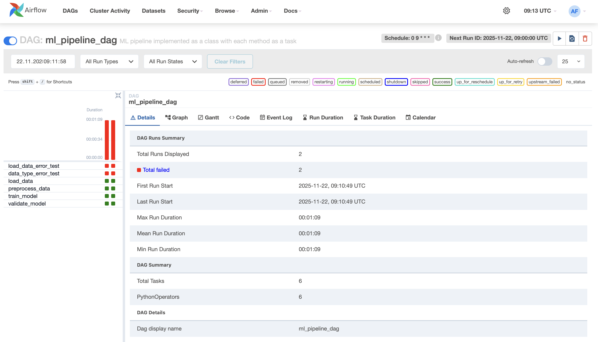
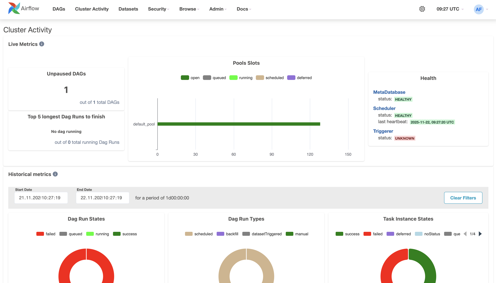
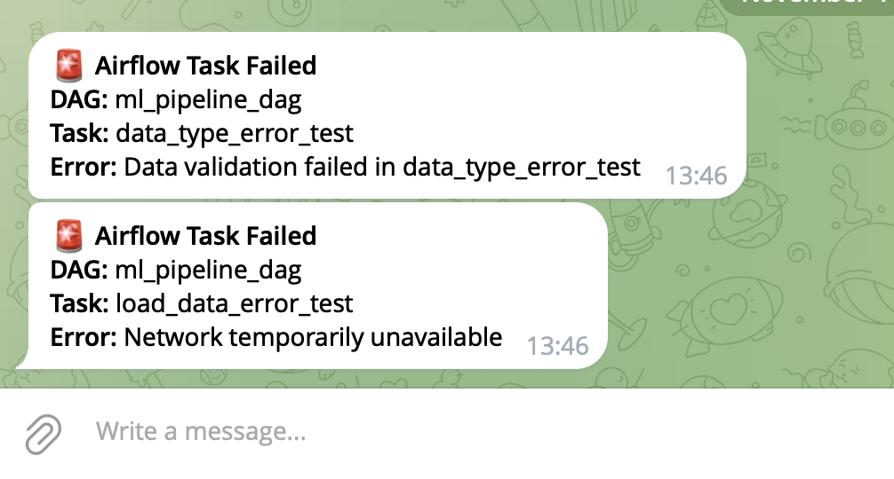

# 📘 Отчёт по ДЗ №4  
## Тема: Автоматизация ML пайплайнов

**Студент:** Семён Мынко  
**Дата:** 22.11.2025  

---

## 1. Цель работы
Создайте автоматизированные ML пайплайны с использованием современных инструментов оркестрации.
---

## 2. Настройка выбранного инструмента 
### Инструмент: Airflow

**Был написан простой Dockerfile:**
```docker
FROM apache/airflow:2.10.2-python3.9

COPY requirements.txt .
RUN pip install --no-cache-dir -r requirements.txt
```

**Далее был написан стандарный docker-compose файл**
**Конфигурация Airflow состоит из**
```bash
airflow-init - инициализация параметров запуска
postgres - внутренняя база для хранения метаданных
airflow-webserver - ui вебсервер
airflow-scheduler - планировщик запусков задач
```

**Далее был написан простой ml пайплайн**



## 3. Настройка инструмента для упрвления конфигурациями
### Инструмент: Pydantic

**Была создана структура хранения конфигов**

``` bash
config/
 ├── base_config.py
 ├── models/
 │     ├── random_forest.yaml
 │     ├── gradient_boosting.yaml
 │     └── logistic_regression.yaml
 ├── datasets/
 │     └── dataset.yaml
 └── loader.py
```

**С помощью pydantic были созданы модели для конфигов, которые подтягивают параметры из конфигурационных yaml файлов**

``` python
from pydantic import BaseModel, Field, validator
from typing import Optional, Literal


class ModelConfig(BaseModel):
    algorithm: Literal["RandomForest", "GradientBoosting", "LogisticRegression"]
    n_estimators: Optional[int] = None
    max_depth: Optional[int] = None
    learning_rate: Optional[float] = None

    @validator("n_estimators", always=True)
    def check_estimators(cls, v, values):
        if values["algorithm"] in ["RandomForest", "GradientBoosting"] and v is None:
            raise ValueError("n_estimators must be set for ensemble algorithms.")
        return v


class DatasetConfig(BaseModel):
    test_size: float = Field(..., ge=0.05, le=0.5)
    random_state: int = 42


class FullConfig(BaseModel):
    model: ModelConfig
    dataset: DatasetConfig
```

## 4. Интеграция и тестирование

**Мониторинг выполнения задач можно проводить как на странице дага (в примерах выше), так и на вкладке активности кластера**


**Дополнительно были настроены и протестированы уведомления о падениях задач в Телеграм**


**Так же были произведены несколько запусков пайплайна, которые показали индемпотентность процесса**
