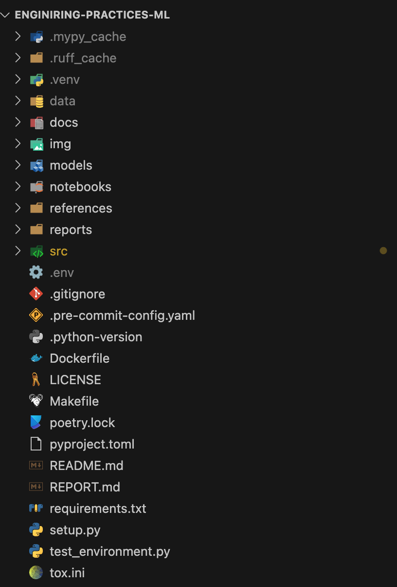
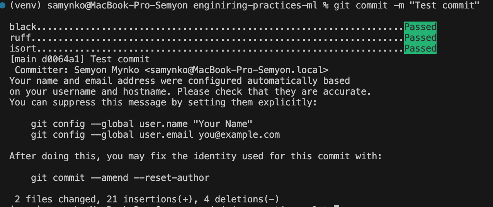
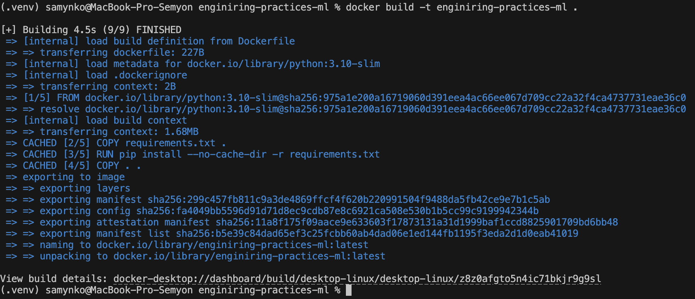
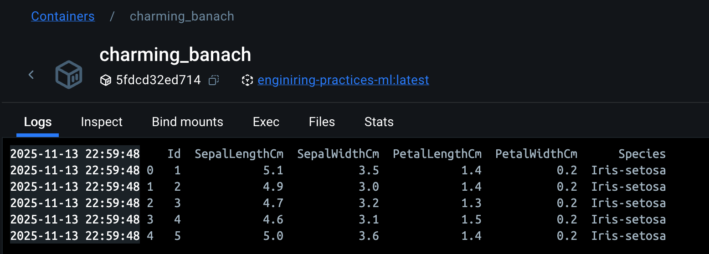
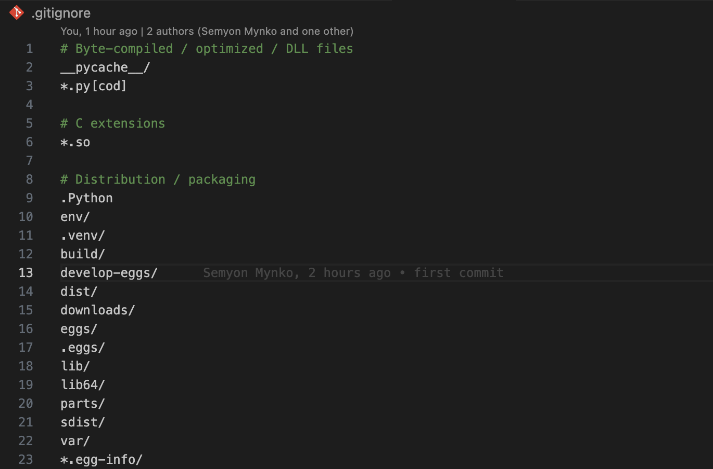

# 📘 Отчёт по ДЗ №1  
## Тема: Настройка рабочего места Data Scientist  

**Студент:** Семён Самынко  
**Дата:** 13.11.2025  

---

## 1. Цель работы
Настроить полноценное рабочее место для Data Science с использованием современных инженерных практик: управление зависимостями, контроль версий, проверка качества кода и контейнеризация.

---

## 2. Структура проекта

### Инструмент: **Cookiecutter**
Для создания структуры проекта использовался шаблон:
```bash
cookiecutter https://github.com/drivendata/cookiecutter-data-science
```


## 3. Управление зависимостями
### Инструмент: Poetry

Использовался для управления зависимостями и создания изолированного окружения.

**Установка:**
```bash
pip install poetry
poetry init
poetry add pandas scikit-learn matplotlib
poetry export -f requirements.txt --output requirements.txt --without-hashes
```

## 4. Качество кода
### Инструменты:

- Black — форматирование кода
- isort — сортировка импортов
- Ruff — линтер
- MyPy — проверка типов
- Bandit — проверка безопасности
- pre-commit — автоматический запуск проверок перед коммитом

### Установка и активация хуков:
```bash
pre-commit install
```


## 5. Контейнеризация
### Инструменты: Docker

### Dockerfile:
```bash
FROM python:3.10-slim

RUN apt-get update && apt-get install -y curl && apt-get clean
RUN curl -sSL https://install.python-poetry.org | python3 -
ENV PATH="/root/.local/bin:$PATH"

WORKDIR /app
COPY pyproject.toml poetry.lock* ./
RUN poetry install --no-interaction --no-ansi
COPY . .

CMD ["poetry", "run", "python", "src/main.py"]
```
### Сборка и запуск
```
docker build -t enginiring-practices-ml .
docker run --rm enginiring-practices-ml
```




## 5. Git Workflow
### Файл .gitignore настроен для исключения:

